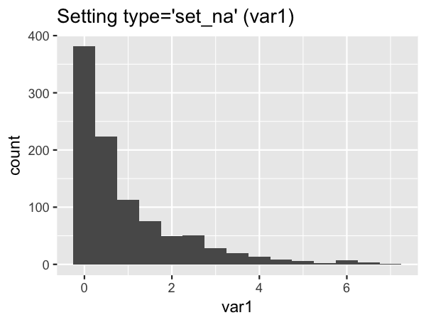

Treatment of Outliers
====

### What is this about?

`prep_outliers` function tries to automatize as much as it can be outliers preparation. It focus on the values that heavily influence the mean.
It sets an `NA` or stops at a certain value all outliers for the desired variables.
<br>


```r
## Loading funModeling !
suppressMessages(library(funModeling))
data(heart_disease)
```


**Outlier threshold**: The method to detect them is based on the percentile, flagging as an outlier if the value is on the top X % (commonly 0.5%, 1%, 2%). Setting the parameter `top_percent` in `0.01` will flag all values on the top 1%.

Same logic goes for the lowest values, setting parameter `bottom_percent` in 0.01 will flag as an outlier the lowest 1% of all values.

**Models highly affected by a biased mean**: linear regressions, logistic regressions, kmeans, decision trees. Random forest deals better with outliers. 
 
**Automatization**: `prep_outliers` skips all factor/char columns, so it can receive a whole data frame, removing outliers by finally, returning a the _cleaned_ data.

<br>
 
This function covers two typical scenarios (parameter `type`):

* Case 1: Descriptive statistics / data profiling
* Case 2: Data for the predictive model


### Case 1: `type='set_na'`

In this case all outliers are converted into `NA`, thus applying most of the descriptive functions (max, min, mean) will return a **less-biased mean** value - with the proper `na.rm=TRUE` parameter.


### Case 2: `type='stop'`

The previous case will cause that all rows with `NA` values will be lost when a machine learning model is trained. To avoid this, but keep the outliers controlled, all values flagged as outlier will be converted to the threshold value.

**Key notes**: 

* Try to think variables treatment (and creation) as if you're explaining to the model. Stopping variables at a certain value, 1% for example, you are telling to the model: _consider all extremes values as if they are on the 99% percentile, this value is already high enough_
* Models try to be noise tolerant, but you can help them by treat some common issues.


## Examples


```r
########################################
# Creating data frame with outliers
########################################
set.seed(10)
df=data.frame(var1=rchisq(1000,df = 1), var2=rnorm(1000))
df=rbind(df, 1135, 2432) # forcing outliers
df$id=as.character(seq(1:1002))

# for var1: mean is ~ 4.56, and max 2432
summary(df)
```

```
##       var1                var2                id           
##  Min.   :   0.0000   Min.   :  -3.2282   Length:1002       
##  1st Qu.:   0.0989   1st Qu.:  -0.6304   Class :character  
##  Median :   0.4455   Median :  -0.0352   Mode  :character  
##  Mean   :   4.5666   Mean   :   3.5512                     
##  3rd Qu.:   1.3853   3rd Qu.:   0.6242                     
##  Max.   :2432.0000   Max.   :2432.0000
```

### Case 1: `type='set_na'`


```r
########################################################
### CASE 1: Treatment outliers for data profiling
########################################################

#### EXAMPLE 1: Removing top 1% for a single variable

# checking the value for the top 1% of highest values (percentile 0.99), which is ~ 7.05
quantile(df$var1, 0.99)
```

```
##      99% 
## 7.052883
```

```r
# Setting type='set_na' sets NA to the highest value)
var1_treated=prep_outliers(data = df,  str_input = 'var1',  type='set_na', top_percent  = 0.01)

# now the mean (~ 0.94) is less biased, and note that: 1st, median and 3rd quartiles remaining very similar to the original variable.
summary(var1_treated)
```

```
##       var1               var2                id           
##  Min.   :0.000003   Min.   :  -3.2282   Length:1002       
##  1st Qu.:0.095676   1st Qu.:  -0.6304   Class :character  
##  Median :0.438830   Median :  -0.0352   Mode  :character  
##  Mean   :0.940909   Mean   :   3.5512                     
##  3rd Qu.:1.326450   3rd Qu.:   0.6242                     
##  Max.   :6.794558   Max.   :2432.0000                     
##  NA's   :11
```

```r
#### EXAMPLE  2: if 'str_input' is missing, then it runs for all numeric variables (which have 3 or more distinct values).
df_treated2=prep_outliers(data = df, type='set_na', top_percent  = 0.01)
summary(df_treated2)
```

```
##       var1               var2               id           
##  Min.   :0.000003   Min.   :-3.22817   Length:1002       
##  1st Qu.:0.095676   1st Qu.:-0.64758   Class :character  
##  Median :0.438830   Median :-0.05779   Mode  :character  
##  Mean   :0.940909   Mean   :-0.05862                     
##  3rd Qu.:1.326450   3rd Qu.: 0.57706                     
##  Max.   :6.794558   Max.   : 1.99101                     
##  NA's   :11         NA's   :23
```

```r
#### EXAMPLE  3: Removing top 1% (and bottom 1%) for 'N' specific variables.
vars_to_process=c('var1', 'var2')
df_treated3=prep_outliers(data = df, str_input = vars_to_process, type='set_na', bottom_percent = 0.01, top_percent  = 0.01)
summary(df_treated3)
```

```
##       var1               var2               id           
##  Min.   :0.000003   Min.   :-1.98803   Length:1002       
##  1st Qu.:0.095676   1st Qu.:-0.60871   Class :character  
##  Median :0.438830   Median :-0.03522   Mode  :character  
##  Mean   :0.940909   Mean   :-0.00420                     
##  3rd Qu.:1.326450   3rd Qu.: 0.58415                     
##  Max.   :6.794558   Max.   : 1.99101                     
##  NA's   :11         NA's   :45
```

### Case 2: `type='stop'`


```r
########################################################
### CASE 2: Treatment outliers for predictive modeling
########################################################
#### EXAMPLE 4: Stopping outliers at the top 1% value for all variables. For example if the top 1% has a value of 7, then all values above will be set to 7. Useful when modeling because outlier cases can be used.
df_treated4=prep_outliers(data = df, type='stop', top_percent = 0.01)

# before
summary(df$var1)
```

```
##      Min.   1st Qu.    Median      Mean   3rd Qu.      Max. 
##    0.0000    0.0989    0.4455    4.5670    1.3850 2432.0000
```

```r
# after, the max value is 7
summary(df_treated4$var1)
```

```
##     Min.  1st Qu.   Median     Mean  3rd Qu.     Max. 
## 0.000003 0.098870 0.445500 1.007000 1.385000 7.000000
```

### Plots
Note that when `type='set_na'`, the last points disappear

```r
ggplot(df_treated3, aes(x=var1)) + geom_histogram(binwidth=.5) + ggtitle("Setting type='set_na' (var1)")
```

```
## Warning: Removed 11 rows containing non-finite values (stat_bin).
```



```r
ggplot(df_treated4, aes(x=var1)) + geom_histogram(binwidth=.5) + ggtitle("Setting type='stop' (var1)")
```


<br>

